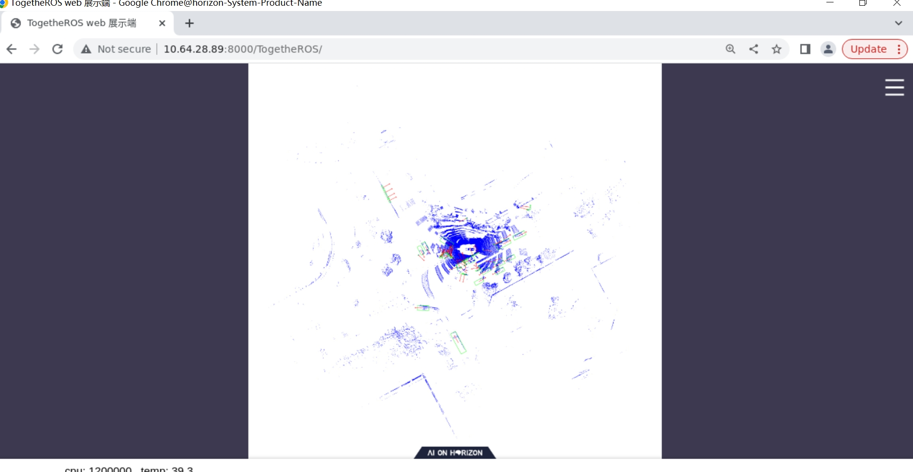

Getting Started with Hobot CenterPoint Node
=======


# 功能介绍


# 开发环境

- 编程语言: C/C++
- 开发平台: J5
- 系统版本：Ubuntu 20.0.4
- 编译工具链:Linux GCC 9.3.0/Linaro GCC 9.3.0

# 编译

- J5版本：支持在J5 Ubuntu系统上编译和在PC上使用docker交叉编译。

## J5 Ubuntu系统上编译 J5版本

1、编译环境确认

- 板端已安装J5 Ubuntu系统。

- 当前编译终端已设置TROS·B环境变量：`source /opt/tros/setup.bash`。

- 已安装ROS2软件包构建系统ament_cmake。安装命令：`apt update; apt-get install python3-catkin-pkg; pip3 install empy`

- 已安装ROS2编译工具colcon。安装命令：`pip3 install -U colcon-common-extensions`

2、编译

- 编译命令：`colcon build --packages-select hobot_centerpoint`

## docker交叉编译 J5版本

1、编译环境确认

- 在docker中编译，并且docker中已经编译好TROS·B。docker安装、交叉编译、TROS·B编译和部署说明详见[地平线机器人平台用户手册](https://developer.horizon.ai/api/v1/fileData/TogetherROS/quick_start/cross_compile.html#togetherros)。

2、编译

- 编译命令：

  ```shell
  bash robot_dev_config/build.sh -p J5 -s hobot_centerpoint
  ```

# 使用介绍

## 参数
|         字段         |      类型    |         描述       | 是否必须 |         默认值              |
| -------------------- | ----------- | ------------------ | ------- | --------------------------- |
| preprocess_config     |   string    |   预处理配置文件   |   否     |config/centerpoint_preprocess_5dim.json|
| model_file            |   string    |centerpoint模型文件路径|   否  |     config/model/model.hbm  |
| lidar_list_file       |   string    |本地回灌激光雷达文件列表|   否   |config/nuscenes_lidar/nuscenes_lidar.lst |
| is_show             |     bool      | 是否进行渲染展示    |     否  |  true               |
| is_loop             |     bool      | 本地回灌是否循环进行  |   否  |   true                |
| pub_topic_name      |     string    | 发布的可视化图片话题名  |   否  | /hobot_centerpoint   |
| lidar_pre_path      |     string    | 回灌的二进制文件所在路径 | 否  | config/hobot_centerpoint_data               |

## J5 Ubuntu系统上运行

**准备回灌数据集**
```shell
# 板端下载数据集
wget http://archive.sunrisepi.tech/TogetheROS/data/hobot_centerpoint_data.tar.gz

# 解压缩
tar -zxvf hobot_centerpoint_data.tar.gz

# 解压完成后数据集在hobot_centerpoint_data路径下
```

**使用本地数据集回灌**

```shell
# 配置TogetheROS·Bot环境
source /opt/tros/setup.bash

# 启动运行脚本，并指定数据集路径
ros2 launch hobot_centerpoint hobot_centerpoint_websocket.launch.py lidar_pre_path:=hobot_centerpoint_data
```

PC的WEB端输入板端IP地址`http://IP:8000`，展示回灌结果和实时渲染：
